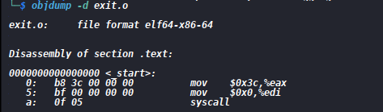
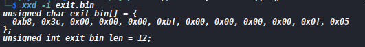

# Extracting Raw Shellcode Bytes

I will be using the assembly program [ exit a process program ](./Codes/exit.asm)
Then assembling it with:
`nasm -f elf6 exit.asm -o exit.o`
This produces the ELF relocatable object containing the machine code.
Inspect the .text section using the objdump tool using the command
`objdump -d exit.o`
Output: 
The important part are the instruction bytes to the left. The next step is extracting the raw bytes with objcopy
`objcopy -j .text -O binary  exit.o  exit.bin`
The exit.bin now contains raw machine code bytes, without the ELF headers. We can check them with
`xxd -g 1 exit.bin`
Output : 
We can then convert them to  \x.. which is the shellcode notation.It is simply writing the whole bytes as a string rather than separate characters
`xxd -p exit.bin`
We can also produce the C-style escaped bytes with:
`xxd -i exit.bin`
Output: 
You can then execute the bytes [from a C program ](./Codes/byte_executor.c)
Compile and execute it and then `echo $?` the expectation is 42 since the machine code invokes LInux `exit (42)`
From our output it should give 0
